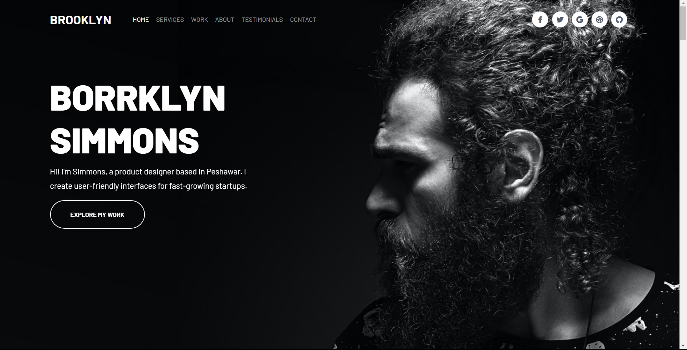
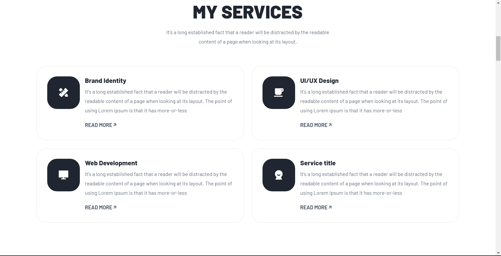

# Jack Pope Portfolio Website

## Overview

Jack Pope Portfolio Website is a responsive website showcasing the portfolio of Jack Pope. This project was developed as part of my frontend web development practice to improve my skills in HTML, CSS, and JavaScript.

The website includes sections like an introduction, projects showcase, testimonials, and a contact form to provide visitors with a comprehensive view of Borrklyn's work and abilities.

Live Demo: **\_\_**

## Technologies Used

- HTML
- CSS
- [Remix Icons](https://remixicon.com) - A library of open-source icons designed by Refactoring UI.
- [Google Fonts](https://fonts.google.com) - Open-source fonts from Google's font library.
- [AOS Library](https://michalsnik.github.io/aos/) - AOS is a small library for smooth animations on scroll.

## Features

- Responsive Design: The website is fully responsive and adjusts to various screen sizes, ensuring an optimal viewing experience on desktop, tablets, and mobile devices.
- Smooth Transitions: The AOS library is utilized to create smooth and elegant transitions and appearances of certain elements as the user scrolls down the page.
- Projects Showcase: The website includes a dedicated section to showcase Borrklyn's latest projects with descriptions and links to view them.
- Testimonials: Visitors can read testimonials from satisfied clients, giving credibility to Borrklyn's skills and services.
- Contact Form: The contact form allows users to get in touch with Borrklyn for inquiries or collaborations.

## Screenshots

## How to Use

1. Clone the repository: ``
2. Open `index.html` in your web browser to view the website locally.

## Contribution

This project was created as a personal practice project, but contributions, bug fixes, and improvements are welcome. If you find any issues or have suggestions for improvements, feel free to open an issue or submit a pull request.
